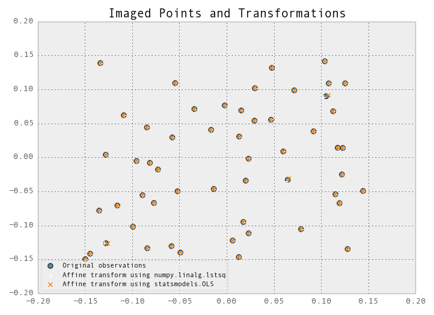

This is a repo for messing about with least squares methods in Python

See here for motivation: http://stats.stackexchange.com/questions/66538/using-pandas-and-statsmodels-for-ordinary-least-squares

Data is contained in pickled pandas objects in the data directory.

As of 05 August 2013, [coordinates.pickle](data/coordinates.pickle) contains coordinates, residuals, and updated coordinates, which are the result of a `numpy.linalg.lstsq` operation on [A_matrix.pickle](data/A_matrix.pickle), [b_vector.pickle](data/b_vector.pickle), which returns values for `a0, a1, a2, b0, b1, b2`. This [vector](data/params.pickle) (`x`) can be used to calculate residuals using the following operation:  
`Ax-b`. The resulting residual vector contains all `x` residuals, followed by all `y` residuals. These can be added to the existing `x` and `y` coordinates to produce updated positions, which can be seen as orange crosses in the picture below.

