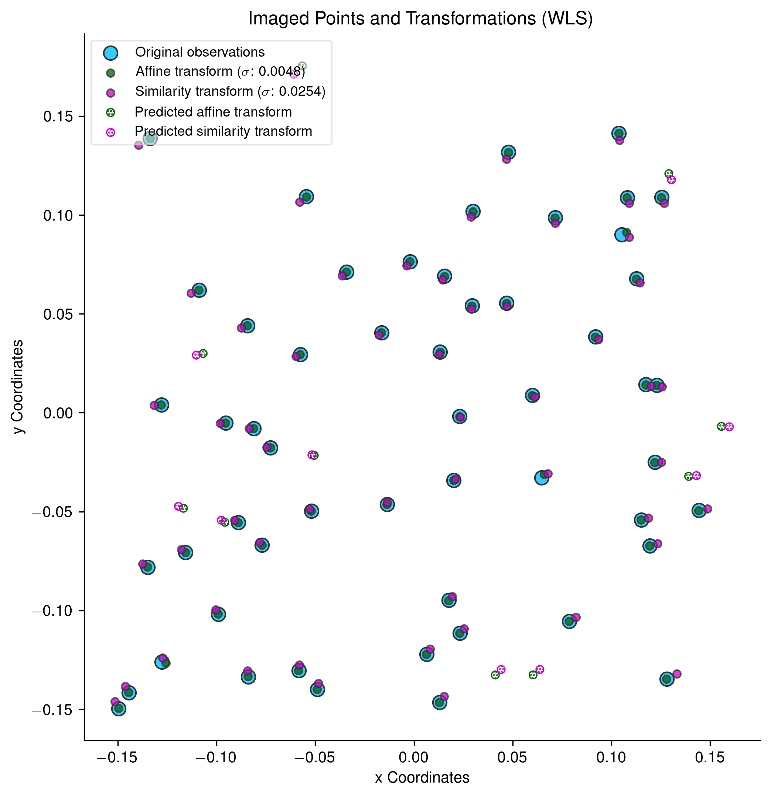

# Least Squares Estimation in Python, using [Pandas](http://pandas.pydata.org) and [Statsmodels](http://statsmodels.sourceforge.net)

Theory, equations and matrix shapes for data used in an **ordinary least squares** operation which fits a line through a set of points representing measured distances are shown at the top of this [IPython notebook](http://nbviewer.ipython.org/urls/raw.github.com/urschrei/linalg/master/notebooks/ordinary_least_squares.ipynb).

Theory, equations and matrix shapes for data used in a **weighted least squares** operation which compares the accuracy of a similarity and affine transform of observed *x* and *y* coordinates are shown at the top of this [IPython notebook](http://nbviewer.ipython.org/urls/raw.github.com/urschrei/linalg/master/notebooks/weighted_least_squares.ipynb).  
This notebook also demonstrates the use of estimated parameters to calculate transformed coordinates of new input points, using both statsmodels `predict()` function, and manually, using a transformation matrix.

## Terminology
`A`, `A matrix`, `X`: the design matrix, referred to as *exogenous* in the [statsmodels](http://statsmodels.sourceforge.net/stable/) module. The explanatory variable, or *regressors*.  
`b`, `b vector`, `Y`: the outcome vector, referred to as *endogenous* in the statsmodels module. The response variable, or *regressand*.  

See the [docs](http://statsmodels.sourceforge.net/devel/endog_exog.html) for a complete explanation.
It should also be noted that the signatures of the [numpy.linalg.lstsq](http://docs.scipy.org/doc/numpy/reference/generated/numpy.linalg.lstsq.html) and [statsmodels.WLS](http://statsmodels.sourceforge.net/devel/generated/statsmodels.regression.linear_model.WLS.html#statsmodels.regression.linear_model.WLS) methods are reversed: numpy expects the design matrix followed by the outcome vector, while statsmodels expects the outcome vector followed by the design matrix.  

Data is contained in CSVs in the data directory:

[coordinates.csv](data/coordinates.csv) contains imaged coordinates of the control points, while [ground_control_points.csv](data/ground_control_points.csv) contains the actual coordinates in eastings and northings. For the OLS example, [year_distance.csv](data/year_distance.csv) contains the data for the ordinary least squares transform.  

The matrices are described for the least squares methods using a [patsy](http://patsy.readthedocs.org/en/latest/overview.html) formula, which is similar to those used in *R*, though they can also be specified in terms of endog/exog (or `y` and `X` etc.) using the uppercase versions of the methods found in `statsmodels.formula.api`.  
**NB**: If you are _not_ using `patsy` to describe the OLS formula, you must ensure that your design matrix contains an intercept by including a constant term. You can do this manually, or by using the [`add_constant`](https://www.statsmodels.org/stable/generated/statsmodels.tools.tools.add_constant.html) method. If you do _not_ do this, your results will be wrong: the line will be fitted as if the `b` term in `y = mx + b` was 0.

---
It's apparent from the scatter plot shown at the top of the page that the affine transformation is the more accurate of the two, however we can compare the quality of the two transformations by obtaining the sigma zero value, which is the standard error of the *weighted residual variance* for each transform, and can be calculated by taking the square root of either the [`mse_resid`](http://en.wikipedia.org/wiki/Mean_squared_error#Regression) or (more correctly in a weighted regression) the [`scale`](http://statsmodels.sourceforge.net/stable/generated/statsmodels.regression.linear_model.RegressionResults.html) attribute of the result object:  

**Standard error of the affine transform**: 0.0048  
**Standard error of the similarity transform**: 0.0254

---
The ordinary least squares fit example is just a dummy set of measurements, regressed against the year in which they were made.
Green points on the plot show actual measurements, while the fuchsia-coloured line shows the best fit following least squares treatment.  

