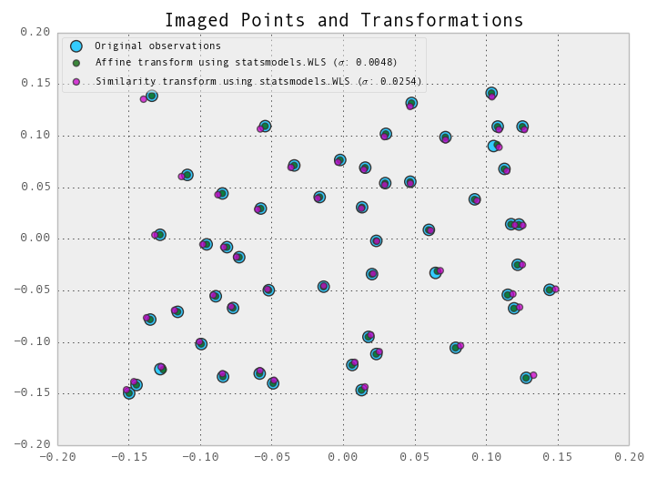

# This is a repo for messing about with least squares methods in Python #

See here for motivation: http://stats.stackexchange.com/questions/66538/using-pandas-and-statsmodels-for-ordinary-least-squares

Data is contained in pickled pandas objects in the data directory.

[coordinates.pickle](data/coordinates.pickle) contains observed coordinates, residuals, and updated coordinates, which are the result of a [numpy.linalg.lstsq()](http://docs.scipy.org/doc/numpy/reference/generated/numpy.linalg.lstsq.html) operation on [A_matrix.pickle](data/A_matrix.pickle), [b_vector.pickle](data/b_vector.pickle), which returns values for `a0, a1, a2, b0, b1, b2`. This [vector](data/params.pickle) (`x`) is used to calculate residuals using `Ax-b`. The resulting residual vector contains all `x` residuals, followed by all `y` residuals. These are added to the existing `x` and `y` coordinates to produce updated positions, which can be seen as white crosses in the figure below. The orange crosses are the result of running [statsmodels.OLS().fit()](http://statsmodels.sourceforge.net/devel/generated/statsmodels.regression.linear_model.OLS.html#statsmodels.regression.linear_model.OLS) on the same data set, splitting the residuals into two columns in the `coords` DataFrame, and generating updated `x` and `y` values by subtracting them from the original observations:

You can see the IPython notebook used to generate the figure [here](http://nbviewer.ipython.org/urls/raw.github.com/urschrei/linalg/master/statsmodels.ipynb).

**TODO**:
- Incorporate a weight matrix
- Perform a similarity transform
- Compare the quality of the two
- Get some sleep
